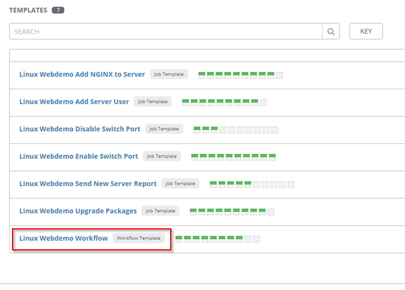

# Ansible Tower Workflow Lab
## Introduction
One of the many benefits of Ansible and the Ansible Automation Platform is its ability to automate across departments in your IT organization.  For example, let's say a new web server is required. In the past the server team would be notified and would begin provisioning the new server.  The network team would also be notified to begin its process of configuring switch ports, opening firewall rules, or setting up a load balancer. Even if each team is automating some or all of their tasks, they are doing so in silos.  They may use different tools with different processes. With Ansible Tower, we can combine these efforts into a single workflow so that all the teams speak the same automation language.

In a production environment there would be many steps to bring a new server into production, but for demo purposes we'll keep the list short.  We will configure a switch port, perform an update to a CentOS server, install NGINX, add a new admin user, and finally email a report.  

## Workflows

A workflow consists of individual job that can be grouped together with logical branches. We can also add a Project Sync that will make sure we have all the latest copies of our playbook from github, or other version control system.

Take a moment to review the workflow below.  A green line signifies success.  Red means failure.  And blue means always.  If our playbook to upgrade the server is successful, then we proceed to install NGINX. If it fails, we disable the switchport so an administrator can go in and find the problem.


## Requirements

This lab was tested using Ansbile 2.9 and Tower 3.6.  It assumes you have the following

- RHEL 7 or 8 to run Ansible Tower
- [Ansible Tower](https://www.ansible.com/products/tower). Try it for free at the link 
- [Tower CLI](https://docs.ansible.com/ansible-tower/3.5.3/html/towerapi/tower_cli.html) installed on your Tower server
- RHEL/CentOS 7 VM to similute our web server
- [Arista vEOS VM](https://www.arista.com/en/support/software-download) with at least three NICs to simulate our switch.  A sample config is provided in the docs folder.
- Optional:  A gmail email address to send the report.


## Installation

1. In order to configure Tower, we will use the *tower_lab_provision.yml* playbook.   

   SSH into Tower and clone this repo.

```
git clone https://github.com/gejames/Linux-Webserver-Tower-Lab.git && cd Linux-Webserver-Tower-Lab
```

2. Edit the default variables in tower/vars/webdemo_tower.yml for your environment.  

```
vim tower/vars/webdemo_tower.yml
```

3. Run the playbook tower_lab_provision.yml from the CLI on the Tower server. It will ask for your Tower credentials. The provision playbook will configure all the necessary assets to complete the workflow. This includes templates, surveys, credentials, projects, and inventories.   

```
ansible-playbook tower_lab_provision.yml
```

   Once the provisioning playbook is finished, Tower will be populated with the necesasry assests to launch the workflow.

## Launching the Workflow

We'll continue the lab from the Web UI of Tower.  Login to Tower and go to Templates to find the new workflow.



---
Press the rocket ship to launch the job.


---
Once the job launches, you will be presented with a survey. Tower surveys allow administrators to query users for variable data.  This allows even non-technical users to launch powerful Ansible playbooks.  Leave the defaults for now and press Next.


---
Tower will then present the variables it will use in the workflow.  Once you have reviewed the variables and are satisfied they are correct, press Launch


---

As the workflow progresses, their status indictator will turn green if they are succesful.   


---

Press the Details link to see the details for each playbook.


